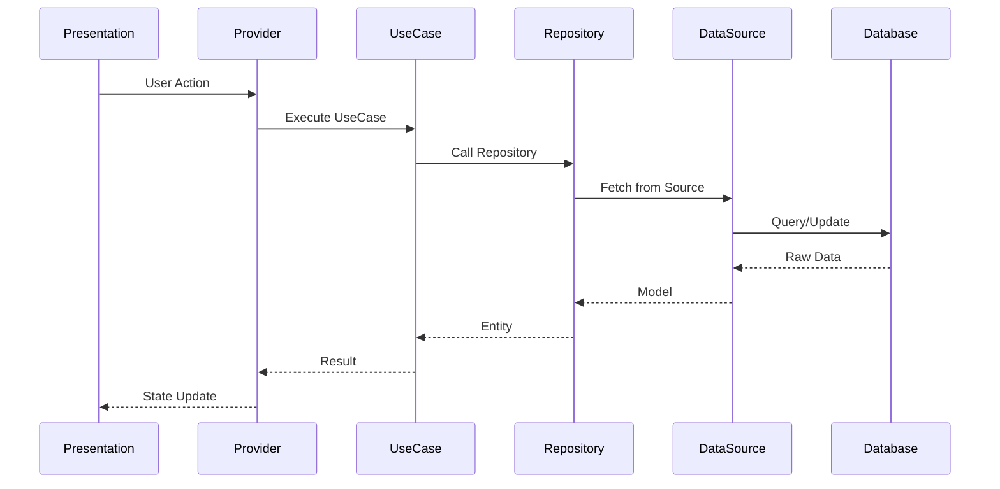
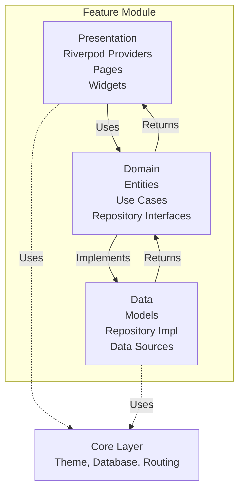
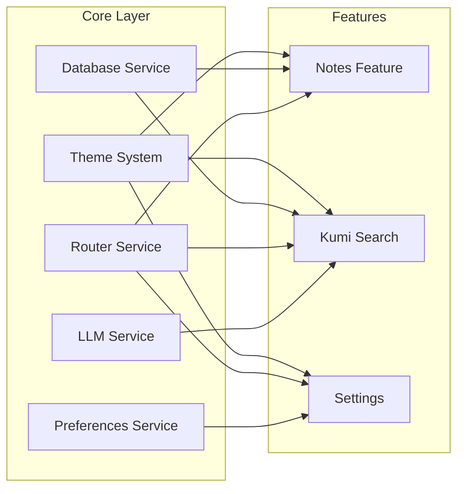
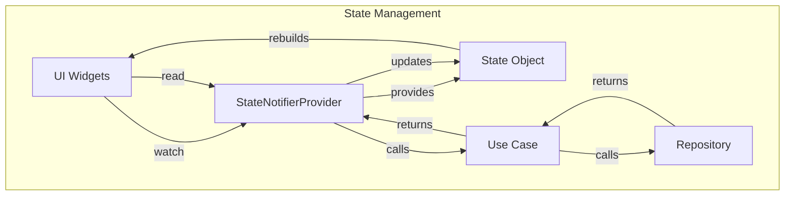

# Architecture Overview

## Table of Contents

- [Overview](#overview)
- [Architectural Pattern](#architectural-pattern)
- [Data Flow](#data-flow)
- [Project Structure](#project-structure)
- [Feature Module Structure](#feature-module-structure)
- [Core Module Architecture](#core-module-architecture)
- [Dependency Direction](#dependency-direction)
- [Testing Strategy](#testing-strategy)
- [State Management](#state-management)
- [Error Handling](#error-handling)
- [CI/CD Considerations](#cicd-considerations)
- [Scalability Considerations](#scalability-considerations)
- [Cross-References](#cross-references)
- [Key Principles Summary](#key-principles-summary)

## Overview

Kumi Note follows **Feature-Driven Architecture** combined with **Clean Architecture** principles. This ensures:
- Clear separation of concerns
- Testable code
- Scalable feature development
- Maintainable codebase

---

## Architectural Pattern

### Feature-Driven Architecture

Features are self-contained modules that own their:
- Data models
- Business logic
- UI components
- State management

**Benefits:**
- Parallel development (teams work on different features)
- Clear ownership (who owns what)
- Easy to add/remove features
- Independent testing

### Clean Architecture Layers

Each feature implements Clean Architecture:

```
┌─────────────────────────────────────────────────────────────┐
│                    PRESENTATION LAYER                      │
│  ┌──────────────┐  ┌──────────────┐  ┌──────────────┐      │
│  │    Pages     │  │   Widgets    │  │   Providers  │      │
│  │   (Riverpod) │  │              │  │   (State)    │      │
│  └──────────────┘  └──────────────┘  └──────────────┘      │
└─────────────────────────────────────────────────────────────┘
                              │
                              │ Uses
                              ▼
┌─────────────────────────────────────────────────────────────┐
│                      DOMAIN LAYER                            │
│  ┌──────────────┐  ┌──────────────┐  ┌──────────────┐      │
│  │   Entities   │  │   Use Cases  │  │  Repository  │      │
│  │   (Models)   │  │  (Business   │  │  Interfaces   │      │
│  │              │  │    Logic)    │  │               │      │
│  └──────────────┘  └──────────────┘  └──────────────┘      │
└─────────────────────────────────────────────────────────────┘
                              │
                              │ Implements
                              ▼
┌─────────────────────────────────────────────────────────────┐
│                       DATA LAYER                             │
│  ┌──────────────┐  ┌──────────────┐  ┌──────────────┐      │
│  │ Repositories │  │ Data Sources │  │    Models    │      │
│  │  (Impl)      │  │  (Drift,     │  │  (DTOs)      │      │
│  │              │  │   API, etc)  │  │               │      │
│  └──────────────┘  └──────────────┘  └──────────────┘      │
└─────────────────────────────────────────────────────────────┘
```

### Dependency Rule

**Inner layers know nothing about outer layers.**

```
Core (No dependencies)
    ↓
Features (Depend on Core)
    ↓
App (Depends on Features + Core)
```

**What this means:**
- Domain layer has **zero** Flutter dependencies
- Data layer only depends on domain
- Presentation layer depends on domain (not data directly)

---

## Data Flow



### Flow Explanation

1. **User Action** - Button press, form submit
2. **Provider** - Receives action, manages state
3. **UseCase** - Contains business logic
4. **Repository** - Abstracts data source
5. **DataSource** - Concrete implementation (Drift, API, etc.)
6. **Database** - Persistent storage

**Back to UI** - Data flows back up, UI rebuilds with new state

---

## Project Structure

```
lib/
├── core/                          # Shared infrastructure
│   ├── database/                  # Drift ORM configuration
│   │   ├── app_database.dart
│   │   ├── database_provider.dart
│   │   └── tables/
│   │       ├── embeddings_table.dart
│   │       └── notes_table.dart
│   │
│   ├── llm/                       # LLM FFI bindings
│   │   └── llm_service.dart
│   │
│   ├── routing/                   # go_router configuration
│   │   └── app_router.dart
│   │
│   ├── theme/                     # Design tokens
│   │   ├── animations.dart
│   │   ├── breakpoints.dart
│   │   ├── colors.dart
│   │   ├── dimensions.dart
│   │   ├── kumi_theme.dart
│   │   ├── radius.dart
│   │   ├── shadows.dart
│   │   ├── spacing.dart
│   │   ├── typography.dart
│   │   └── z_index.dart
│   │
│   └── preferences/               # SharedPreferences wrapper
│       └── preferences_service.dart
│
├── features/                      # Feature modules
│   ├── notes/
│   │   ├── data/
│   │   │   ├── models/
│   │   │   │   └── note_model.dart
│   │   │   ├── repositories/
│   │   │   │   └── note_repository_impl.dart
│   │   │   └── datasources/
│   │   │       └── note_local_datasource.dart
│   │   │
│   │   ├── domain/
│   │   │   ├── entities/
│   │   │   │   └── note_entity.dart
│   │   │   ├── repositories/
│   │   │   │   └── note_repository.dart
│   │   │   └── usecases/
│   │   │       ├── get_notes.dart
│   │   │       ├── create_note.dart
│   │   │       └── delete_note.dart
│   │   │
│   │   └── presentation/
│   │       ├── providers/
│   │       │   └── notes_provider.dart
│   │       ├── pages/
│   │       │   └── notes_page.dart
│   │       └── widgets/
│   │           └── note_card.dart
│   │
│   ├── kumi/                      # Semantic search feature
│   ├── settings/                  # App settings
│   ├── onboarding/                # First-run tutorial
│   └── insights/                  # Statistics & analytics
│
├── app/                           # App-level widgets
│   └── home/
│       └── home_page.dart
│
└── main.dart                      # Entry point
```

---

## Feature Module Structure

Every feature follows this structure:



### Layer Responsibilities

**Presentation Layer:**
- Build UI
- Manage state with Riverpod
- Handle user input
- No business logic

**Domain Layer:**
- Define entities (business objects)
- Implement use cases (business logic)
- Declare repository interfaces
- Pure Dart (no Flutter dependencies)

**Data Layer:**
- Implement repositories
- Handle data sources (Drift, API, etc.)
- Map between DTOs and entities
- Handle errors/exceptions

---

## Core Module Architecture

Core provides shared services used by all features:



---

## Dependency Direction

```
┌────────────────────────────────────────┐
│              APP LEVEL                 │
│  - main.dart                           │
│  - Dependency injection setup          │
└────────────────────────────────────────┘
                    │
                    │ Imports
                    ▼
┌────────────────────────────────────────┐
│            FEATURE LEVEL               │
│  - features/notes/                     │
│  - features/kumi/                      │
│  - Each feature: presentation/         │
│                   domain/              │
│                   data/                │
└────────────────────────────────────────┘
                    │
                    │ Imports
                    ▼
┌────────────────────────────────────────┐
│              CORE LEVEL                │
│  - core/theme/                         │
│  - core/database/                      │
│  - core/routing/                       │
│  - core/llm/                           │
│  - core/preferences/                   │
└────────────────────────────────────────┘
                    │
                    │ Imports
                    ▼
┌────────────────────────────────────────┐
│           FRAMEWORK LEVEL              │
│  - Flutter SDK                           │
│  - Riverpod                            │
│  - go_router                           │
│  - Drift                               │
└────────────────────────────────────────┘
```

**Golden Rule:** Dependencies point inward. Framework → Core → Features → App

---

## Testing Strategy

### Test Pyramid

```
        ┌─────────────┐
        │   E2E Tests │  ← 5%
        │  (Patrol)   │
        └──────┬──────┘
               │
        ┌──────▼──────┐
        │ Widget Tests│  ← 20%
        │  (Riverpod) │
        └──────┬──────┘
               │
        ┌──────▼──────┐
        │  Unit Tests │  ← 75%
        │  (Domain)   │
        └─────────────┘
```

### Test Organization

```
test/
├── core/
│   ├── theme/
│   │   └── kumi_theme_test.dart
│   └── database/
│       └── database_test.dart
│
├── features/
│   ├── notes/
│   │   ├── data/
│   │   │   └── note_repository_impl_test.dart
│   │   ├── domain/
│   │   │   └── get_notes_test.dart
│   │   └── presentation/
│   │       └── notes_provider_test.dart
│   │
│   └── kumi/
│       └── ...
│
└── integration_test/
    └── app_test.dart
```

### What to Test

**Unit Tests (Domain Layer):**
- Use cases
- Entity behavior
- Repository interfaces

**Widget Tests (Presentation Layer):**
- UI components
- Provider state changes
- User interactions

**Integration Tests (E2E):**
- Complete user flows
- Navigation
- Real database operations

---

## State Management

### Riverpod Pattern



### Provider Types Used

| Provider Type | Usage |
|--------------|-------|
| `StateNotifierProvider` | Complex state with business logic |
| `FutureProvider` | Async operations (API calls, DB queries) |
| `StreamProvider` | Real-time updates |
| `Provider` | Simple values, services |

---

## Error Handling

### Layer-Specific Errors

```dart
// Domain Layer - Custom exceptions
class NoteNotFoundException implements Exception {
  final String noteId;
  NoteNotFoundException(this.noteId);
}

// Data Layer - Map to domain exceptions
Future<Note> getNote(String id) async {
  try {
    final data = await database.getNote(id);
    return NoteMapper.toEntity(data);
  } on DatabaseException catch (e) {
    throw NoteNotFoundException(id);
  }
}

// Presentation Layer - Handle with UI
Consumer(builder: (context, ref, child) {
  final state = ref.watch(notesProvider);
  return state.when(
    data: (notes) => NotesList(notes),
    loading: () => const LoadingIndicator(),
    error: (error, _) => ErrorWidget(message: error.toString()),
  );
});
```

---

## CI/CD Considerations

### Build Pipeline

```yaml
# .github/workflows/ci.yml
name: CI

on: [push, pull_request]

jobs:
  test:
    runs-on: ubuntu-latest
    steps:
      - uses: actions/checkout@v4
      - uses: subosito/flutter-action@v2
      - run: flutter pub get
      - run: flutter analyze
      - run: flutter test
      - run: flutter build apk --release
```

### Quality Gates

- ✅ All tests pass
- ✅ `flutter analyze` returns 0 issues
- ✅ Code coverage > 80%
- ✅ No breaking changes (semver)

---

## Scalability Considerations

### Horizontal Scaling (Features)

Add new features without touching existing code:

```
features/
├── notes/          ✅ Existing
├── kumi/           ✅ Existing
├── settings/       ✅ Existing
└── new_feature/    🆕 Just add this
```

### Vertical Scaling (Complexity)

Handle feature growth within layers:

```
features/kumi/
├── data/
│   ├── models/
│   │   ├── embedding_model.dart      # Vector data
│   │   ├── search_result_model.dart   # Search results
│   │   └── query_model.dart           # Query params
│   ├── repositories/
│   │   ├── kumi_repository_impl.dart
│   │   └── embeddings_repository_impl.dart
│   └── datasources/
│       ├── local/
│       │   └── sqlite_vec_datasource.dart
│       └── remote/
│           └── llm_api_datasource.dart
```

---

## Cross-References

- [[../04-Development/Code-Conventions|Code Conventions]] - 40 architecture rules
- [[../03-Design-System/Implementation|Design System]] - Token implementation
- [[../99-Changelog/2026-04-04-Theme-System|Theme System PR]] - Architecture decisions

---

## Key Principles Summary

1. **Dependency Inversion** - Depend on abstractions (interfaces), not concretions
2. **Single Responsibility** - Each class has one reason to change
3. **Open/Closed** - Open for extension, closed for modification
4. **Interface Segregation** - Small, focused interfaces
5. **Don't Repeat Yourself** - Reuse via composition, not copy-paste

---

*Last updated: 2026-04-11*  
*Architecture: Feature-Driven + Clean*  
*Pattern: Presentation → Domain → Data*
